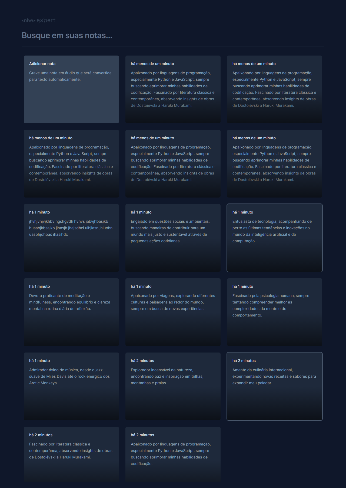
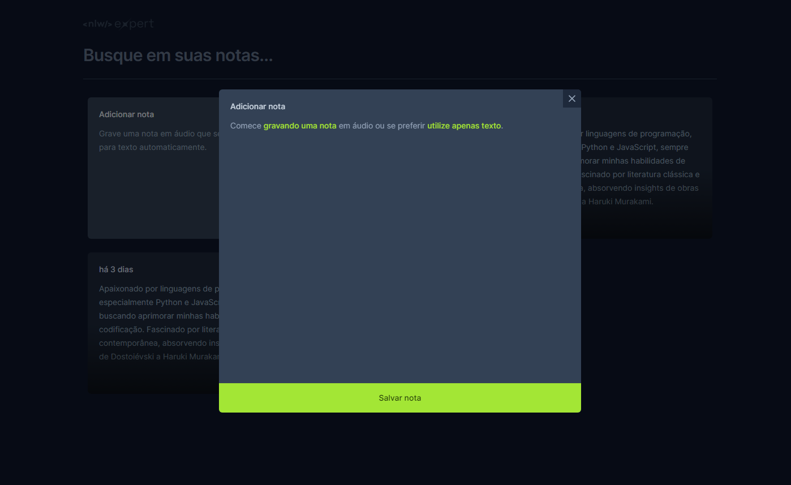

Clique aqui para alterar o idioma:

 

# NLW - Expert Notes

O **Expert Notes** é um projeto apaixonante criado durante o evento NLW da Rocketseat, voltado para entusiastas de tecnologia e desenvolvimento web. Desenvolvido com React e TypeScript, este aplicativo de bloco de notas oferece uma plataforma intuitiva para organizar pensamentos e ideias. Utilizando conceitos modernos de design e UX, o Expert Notes proporciona uma experiência fluida e responsiva em todos os dispositivos. Integrando recursos avançados de armazenamento local, os usuários podem acessar suas notas de forma rápida e segura. Seja para anotar insights de programação ou registrar pensamentos criativos, o **Expert Notes** é a ferramenta essencial para estudantes e profissionais em busca de organização e produtividade.

 

:computer: [Clique aqui para acessar a aplicação](https://nlw-expert-notes-zeta-rust.vercel.app/)

 

 

 

## Tecnologias

 

## Dependencias:

- @radix-ui/react-dialog;
- date-fns;
- lucide-react;
- react;
- react-dom;
- sonner;

## Começando

Este projeto pode ser usado em sua própria máquina após realizar um **PUSH** deste repositório.

### `npm install`

Para baixar e atualizar todas as bibliotecas e dependências do projeto

### `npm run dev`

Executa aplicativo em modo desenvolvimento.\
Abra [http://localhost:5173/](http://localhost:5173/) para vizualizá-lo em seu navegador.

A pagina será recarregada quando você fizer alterações.\
Você também pode ver quaisquer erros de lint no console.

## Contato

  
   
  
   

