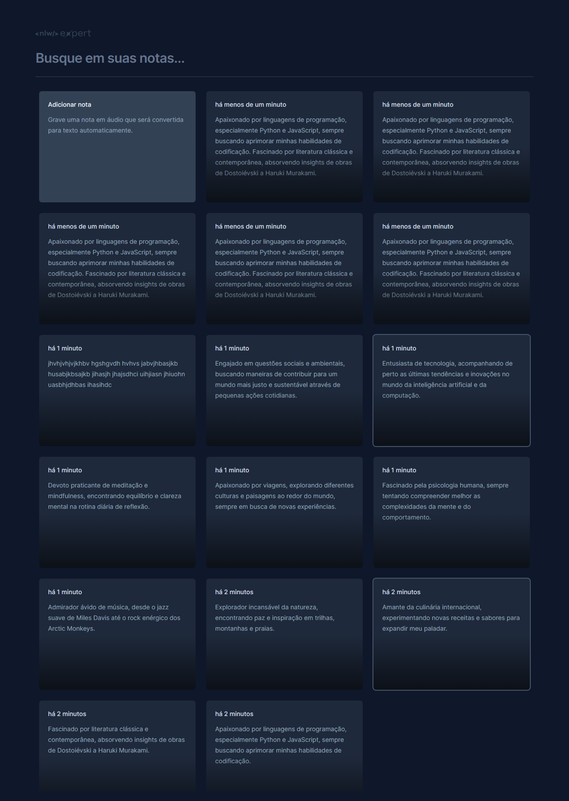

Click here to change the language:

 

# NLW - Expert Notes

**Expert Notes** is an exciting project created during Rocketseat's NLW event, aimed at technology enthusiasts and web development enthusiasts. Developed with React and TypeScript, this note-taking application provides an intuitive platform for organizing thoughts and ideas. Utilizing modern design and UX concepts, **Expert Notes** delivers a seamless and responsive experience across all devices. By integrating advanced local storage features, users can access their notes quickly and securely. Whether jotting down programming insights or capturing creative thoughts, **Expert Notes** is the essential tool for students and professionals seeking organization and productivity.

 

:computer: [Click here to access the application](https://nlw-expert-notes-zeta-rust.vercel.app/)

 

 

 

## Technologies

 

## Dependencies:

- react;
- react-dom;
- react-icons;
- react-router-dom;
- react-scripts;
- web-vitals;

## Getting Started

This project can be used on your own machine after performing a **PUSH** of this repository.

### `npm install`

To download and update all project libraries and dependencies

### `npm start`

Runs the application in development mode.\
Open [http://localhost:3000](http://localhost:3000) to view it in your browser.

The page will reload when you make changes.\
You may also see any lint errors in the console.

## Contact

  
   
  
   

